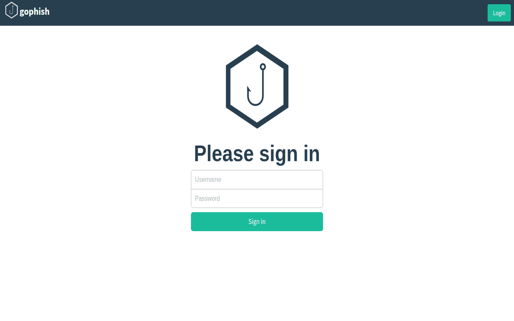
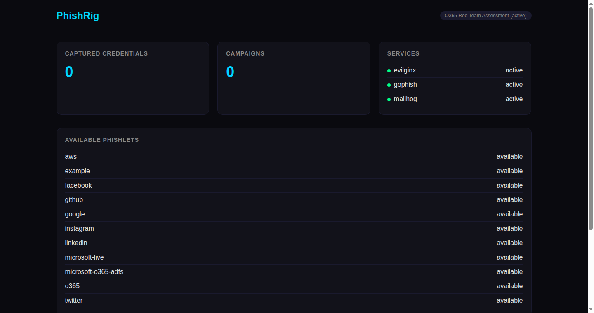
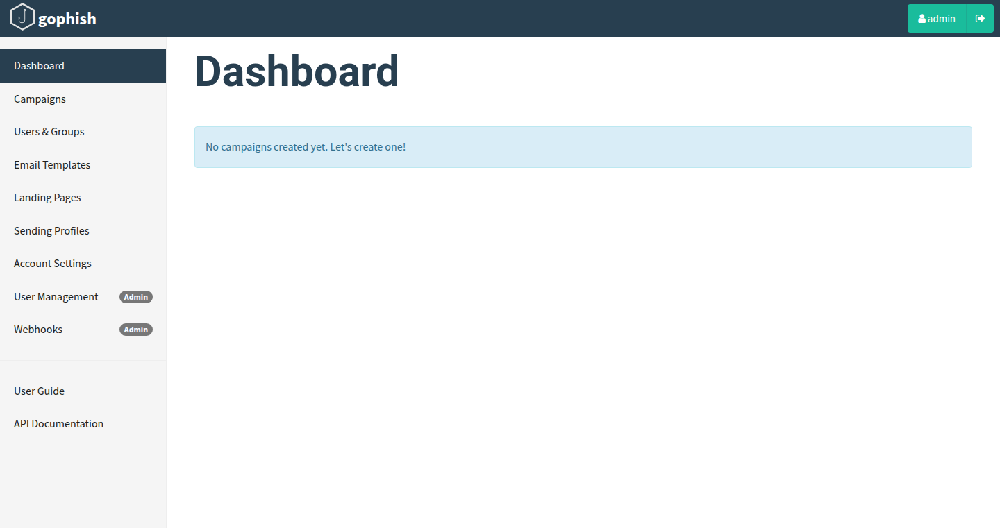
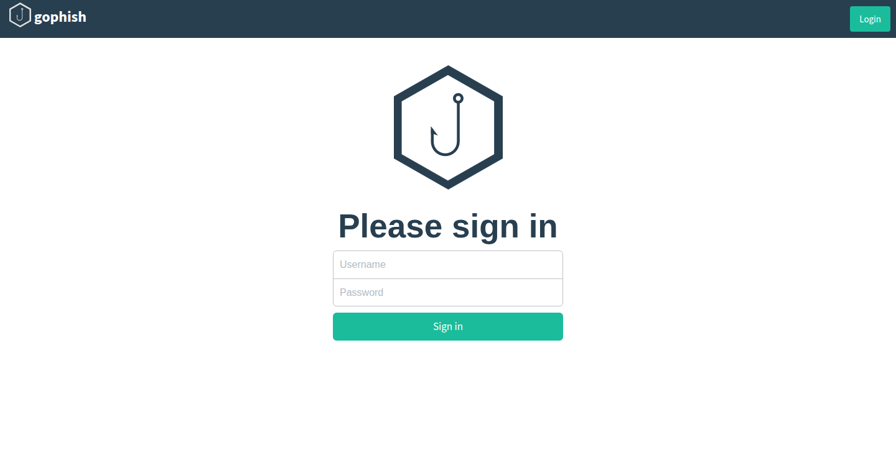
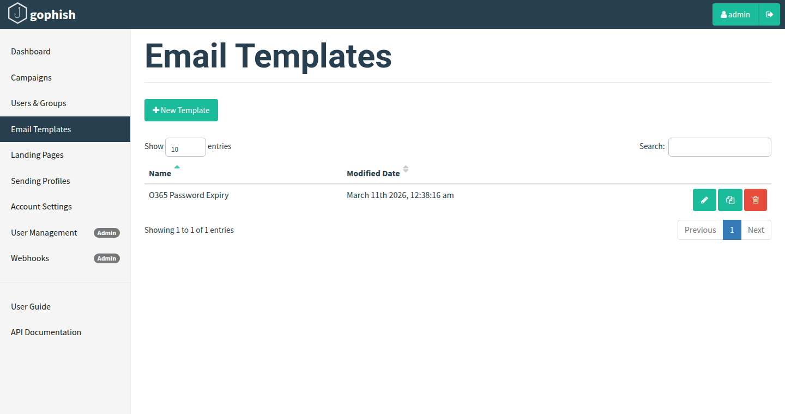
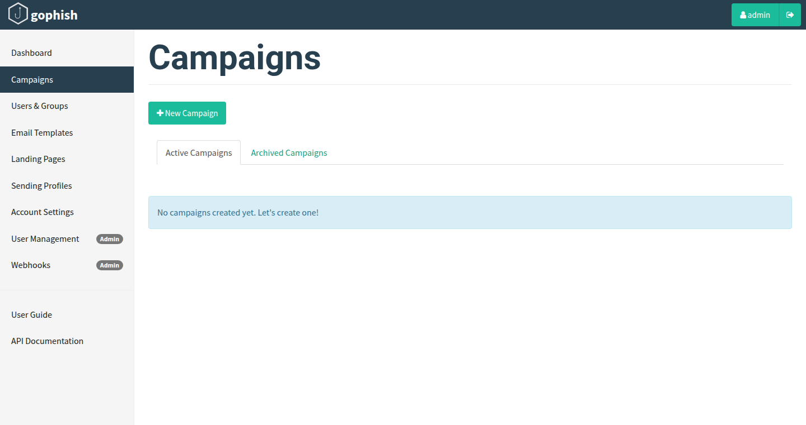
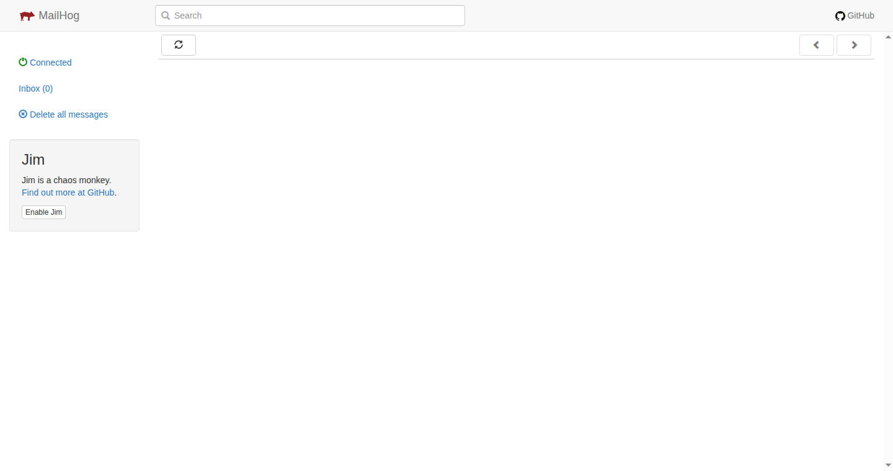

# PhishRig Usage Guide

A step-by-step guide to running a phishing engagement with PhishRig.

> **Prerequisite**: Run `install.sh` first (see [README](../README.md)).



---

## Quick Start (5 minutes)

```
1. Configure   -->   2. Initialize   -->   3. Deploy   -->   4. Monitor
   YAML config         phishrig init     phishrig deploy  Dashboard + CLI
```

---

## Step 1: Configure Your Engagement

Copy the example config and edit it:

```bash
cp configs/engagement.example.yaml phishrig.yaml
nano phishrig.yaml
```

Key fields to customize:

```yaml
engagement:
  name: "Q1 Red Team Assessment"
  client: "Acme Corp"
  id: "ENG-2026-001"

domain:
  phishing: "login.your-domain.com"
  redirect_url: "https://login.microsoftonline.com/"

phishlet:
  name: "o365"                        # Choose from: o365, google, github, etc.
  hostname: "login.your-domain.com"
  auto_enable: true

targets:
  - email: "target@acme.com"
    first_name: "John"
    last_name: "Doe"
    position: "CFO"
```

### Available Phishlets

| Phishlet | Target | Use Case |
|----------|--------|----------|
| `o365` | Microsoft 365 | Corporate email/SSO |
| `google` | Google Workspace | Gmail/Google SSO |
| `github` | GitHub | Developer accounts |
| `microsoft-live` | Outlook/Hotmail | Personal Microsoft |
| `microsoft-o365-adfs` | O365 + ADFS | Federated auth |
| `linkedin` | LinkedIn | Social engineering |
| `twitter` | X/Twitter | Social media |
| `facebook` | Facebook | Social media |
| `instagram` | Instagram | Social media |
| `aws` | AWS Console | Cloud infrastructure |

---

## Step 2: Initialize the Engagement

```bash
phishrig init
```

**What this does:**
- Validates your YAML config
- Generates Evilginx `config.json` with correct bind/external IPs
- Creates the engagement record in SQLite
- Configures Gophish SMTP profile (if API key is set)
- Outputs Evilginx setup commands

Example output:

```
[+] Loading config from phishrig.yaml
[+] Config validated successfully
[+] Generated Evilginx config at /root/.evilginx/config.json
[+] Engagement "Q1 Red Team Assessment" created (ID: ENG-2026-001)
[+] SMTP profile configured via Mailhog (localhost:1025)
[+] Initialization complete
```

Use a custom config file:

```bash
phishrig init -c my-engagement.yaml
```

---

## Step 3: Deploy

```bash
phishrig deploy
```

**What this does:**
- Restarts Evilginx, Gophish, and Mailhog systemd services
- Starts polling Evilginx's BBolt database for captured sessions
- Launches the dashboard on `127.0.0.1:8443`
- Broadcasts new captures via WebSocket in real-time

Example output:

```
[+] Restarting services...
[+] evilginx: active
[+] gophish: active
[+] mailhog: active
[+] Session poller started (interval: 5s)
[+] Dashboard listening on 127.0.0.1:8443
[+] Waiting for captures...
```

---

## Step 4: Monitor Your Engagement



### Option A: CLI Status

```bash
phishrig status
```

```
=== PhishRig Status ===

Engagement: Q1 Red Team Assessment
  Client:   Acme Corp
  Domain:   login.your-domain.com
  Phishlet: o365
  Window:   2026-03-01 to 2026-03-31
  Status:   active
  Captures: 0

Services:
  [+] evilginx: active
  [+] gophish: active
  [+] mailhog: active
  [+] phishrig: active

Phishlets: 11 available (aws, facebook, github, google, instagram,
           linkedin, microsoft-live, microsoft-o365-adfs, o365, twitter)
```

### Option B: Web Dashboard

The dashboard runs on localhost only. Access it via SSH tunnel:

```bash
# From your local machine:
ssh -L 8443:127.0.0.1:8443 user@your-server-ip
```

Then open **http://localhost:8443** in your browser.

The dashboard shows:
- **Captured Credentials** counter (real-time via WebSocket)
- **Service Health** (green/red status indicators)
- **Available Phishlets** and their enabled state
- **Credentials Table** with timestamp, phishlet, username, password, and source IP

```
+--------------------------------------------------+
|  PhishRig              O365 Assessment (active)|
+--------------------------------------------------+
|                                                    |
|  [Captured Credentials]  [Campaigns]  [Services]  |
|        3                    1          3/3 up     |
|                                                    |
+--------------------------------------------------+
|  Available Phishlets                               |
|    o365 .............. enabled                     |
|    google ............ available                   |
|    github ............ available                   |
+--------------------------------------------------+
|  Captured Credentials                              |
|  Time        Phishlet  Username      Password  IP |
|  10:32:15    o365      john@acme..   ********  .. |
|  10:45:03    o365      jane@acme..   ********  .. |
+--------------------------------------------------+
```

---

## Step 5: Send Phishing Emails (Gophish)



### Access Gophish Admin

```bash
# SSH tunnel from your local machine:
ssh -L 8800:127.0.0.1:8800 user@your-server-ip
```

Open **http://localhost:8800** and log in.

Get the initial password:

```bash
journalctl -u gophish | grep password
```



### Create a Campaign

1. **Sending Profile**: Already configured if you set `gophish.api_key` in the YAML.
   Otherwise, create one manually: SMTP host `localhost:1025` (Mailhog), no auth.

2. **Email Template**: Create a template with your phishing pretext.
   Use `{{.URL}}` as the phishing link placeholder — Gophish replaces it automatically.

3. **Landing Page**: Not needed. Evilginx handles the landing page via reverse proxy.

4. **Users & Groups**: Import from your YAML targets or add manually.

5. **Launch Campaign**: Select your profile, template, and group. Hit send.





### Test with Mailhog

Before targeting real users, test with Mailhog:

```bash
# Mailhog Web UI (view captured test emails):
http://your-server-ip:8025
```

All emails sent via `localhost:1025` appear in Mailhog's inbox.



---

## Step 6: Credential Capture Flow

When a target clicks the phishing link:

```
Target clicks link
      |
      v
Evilginx reverse-proxies the real login page
      |
      v
Target enters credentials on the proxied page
      |
      v
Evilginx captures credentials + session tokens
  (stored in /root/.evilginx/data.db)
      |
      v
PhishRig poller detects new session (every 5s)
      |
      v
Credential stored in SQLite + broadcast via WebSocket
      |
      v
Dashboard updates in real-time
```

---

## Dashboard-Only Mode

If services are already running and you just want the dashboard:

```bash
phishrig serve
```

This starts only the web dashboard without restarting any services.

---

## Service Management

Control individual services directly:

```bash
# Check all services
systemctl status evilginx gophish mailhog

# Restart a service
sudo systemctl restart evilginx

# View live logs
journalctl -u evilginx -f
journalctl -u gophish -f
journalctl -u mailhog -f
```

---

## Common Workflows

### Switch Phishlets Mid-Engagement

Edit `phishrig.yaml`, change the `phishlet.name`, then re-initialize:

```bash
phishrig init
phishrig deploy
```

### Multiple Engagements

Use separate config files:

```bash
phishrig init -c client-a.yaml
phishrig deploy -c client-a.yaml
phishrig status -c client-a.yaml
```

### Check DNS Resolution

Before deploying, verify DNS is pointing to your server:

```bash
dig +short login.your-domain.com
# Should return your server's public IP
```

### TLS Certificate Issues

Evilginx uses Let's Encrypt. If you hit rate limits:

```bash
# Check Evilginx logs for cert errors
journalctl -u evilginx | grep -i cert

# Wait ~1 hour for rate limit reset, then restart
sudo systemctl restart evilginx
```

---

## Troubleshooting

| Problem | Solution |
|---------|----------|
| `phishrig init` fails validation | Check YAML syntax: `cat phishrig.yaml \| python3 -c "import sys,yaml;yaml.safe_load(sys.stdin)"` |
| Services won't start | Check ports: `ss -tlnp \| grep -E '80\|443\|53'` |
| No credentials captured | Verify phishlet is enabled: `phishrig status` |
| Dashboard not loading | Ensure SSH tunnel is active: `ssh -L 8443:127.0.0.1:8443 ...` |
| DNS not resolving | Add A-record for your phishing domain pointing to server IP |
| Let's Encrypt rate limit | Wait 1 hour, check `journalctl -u evilginx` for details |
| Gophish emails not arriving | Test with Mailhog first (`localhost:1025`), check `http://server:8025` |
